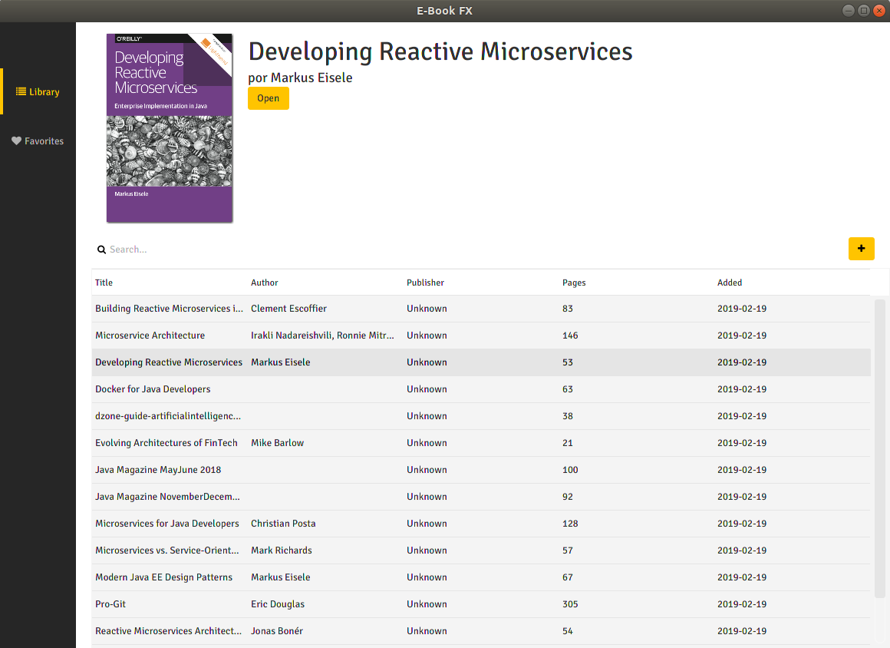

# Ebook.fx
Simple application built with JavaFX that helps me to manage my ebook library (only pdf's), maybe it can be useful to someone.



## Main techonologies used
* Java FX 8
* CDI (Weld SE)
* JPA 2

## Get and Running the application
1. First you need to get an improved version of PDF Renderer from a fork and then
install in your maven local repository.
```
git clone https://github.com/katjas/PDFrenderer
cd PDFrenderer
mvn clean install
```
2. Clone the project, build and run.
```
git clone http://github.com/maykoone/ebook.fx
cd ebook.fx
mvc clean package
java -jar target/*.jar
```
The application will store the information in the data folder, this can be changed in the
[Persistence.xml](src/main/resources/META-INF/persistence.xml)
